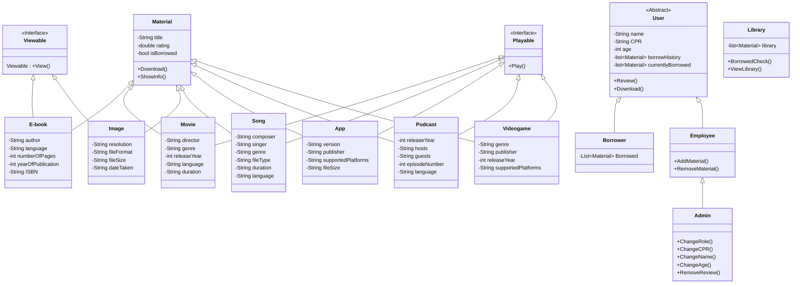

Group members: 

Karoline
Frederik
David
Jeppe

GG

//UML-diagrammer

```mermaid
classDiagram
    class Material{
    -String title
    -double rating
    -bool isBorrowed
    +Download()
    +ShowInfo()
    }
    class Viewable <<Interface>>{
    Viewable : +View()
    }
    class Playable <<Interface>>{
    +Play()
    }
    Viewable <|-- E-book
    Material <|-- E-book
    class E-book{
    -String author
    -String language
    -int numberOfPages
    -int yearOfPublication
    -String ISBN
    }
    Playable <|-- Movie
    Material <|-- Movie
    class Movie{
    -String director
    -String genre
    -int releaseYear
    -String language
    -String duration
    }
    Viewable <|-- Image
    Material <|-- Image
    class Image{
    -String resolution
    -String fileFormat
    -String fileSize
    -String dateTaken
    }
    Playable <|-- Song
    Material <|-- Song
    class Song{
    -String composer
    -String singer
    -String genre
    -String fileType
    -String duration
    -String language
    }
    Playable <|-- App
    Material <|-- App
    class App{
    -String version
    -String publisher
    -String supportedPlatforms
    -String fileSize
    }
    Playable <|-- Podcast
    Material <|-- Podcast
    class Podcast{
    -int releaseYear
    -String hosts
    -String guests
    -int episodeNumber
    -String language
    }
    Playable <|-- Videogame
    Material <|-- Videogame
    class Videogame{
    -String genre
    -String publisher
    -int releaseYear
    -String supportedPlatforms
    }
    class User <<Abstract>>{
    -String name
    -String CPR
    -int age
    -list~Material~ borrowHistory
    -list~Material~ currentlyBorrowed
    +Review()
    +Download()
    }
    User <|-- Borrower
    Borrower : -List~Material~ Borrowed
    User <|-- Employee
    class Employee{
    +AddMaterial()
    +RemoveMaterial()
    }
    Employee <|-- Admin
    class Admin{
    +ChangeRole()
    +ChangeCPR()
    +ChangeName()
    +ChangeAge()
    +RemoveReview()
    }
    class Library{ 
      -list~Material~ library
      +BorrowedCheck()
      +ViewLibrary()
    }
```